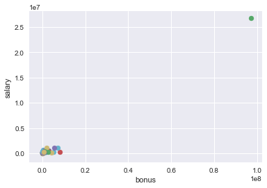
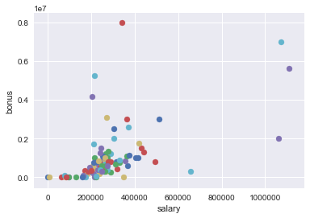
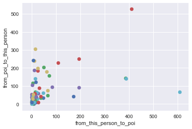

# Identifying Fraud from Enron Email


## Project Background 

Enron was one of the largest corporates in the United States. However, It went into bankruptcy due to widespread corporate fraud. In the subsequent investigation, significant amount of confidential information was published publicly. This includes emails and detailed financial data from top executives.

For this project, we are going to make use of the Enron public data to create a machine learning model to classify whether a person in the Enron dataset is a person of interest (POI) for the Enron corporate fraud case. For more information of the Enron scandal, read here: https://en.wikipedia.org/wiki/Enron_scandal

## Data Preparation


```python
import pickle
import sys
import numpy
import pandas
import sklearn
from time import time
from copy import copy

import matplotlib
%matplotlib inline

import warnings
warnings.filterwarnings('ignore')

sys.path.append("../tools/")

from tester import test_classifier, dump_classifier_and_data
from feature_format import featureFormat, targetFeatureSplit

import enron 
import evaluate

numpy.random.seed(43)
```

## Create features list


```python
## Initiate features list
features_list = ['poi', 'to_messages', 'salary',  'total_payments', 'total_stock_value',
                 'deferral_payments', 'bonus', 'loan_advances', 'expenses', 'shared_receipt_with_poi',
                 'restricted_stock_deferred', 'deferred_income', 'exercised_stock_options',
                 'from_this_person_to_poi', 'from_poi_to_this_person', 'restricted_stock',   
                 'other', 'long_term_incentive', 'from_messages', 'director_fees'] 

## Get POI file
fpoi = open("poi_names.txt", "r")

### Get the dataset
enron_data = pickle.load(open("final_project_dataset.pkl", "r") )

# Test print information of one recpr`d
print enron_data["SKILLING JEFFREY K"]
```

    {'salary': 1111258, 'to_messages': 3627, 'deferral_payments': 'NaN', 'total_payments': 8682716, 'exercised_stock_options': 19250000, 'bonus': 5600000, 'restricted_stock': 6843672, 'shared_receipt_with_poi': 2042, 'restricted_stock_deferred': 'NaN', 'total_stock_value': 26093672, 'expenses': 29336, 'loan_advances': 'NaN', 'from_messages': 108, 'other': 22122, 'from_this_person_to_poi': 30, 'poi': True, 'director_fees': 'NaN', 'deferred_income': 'NaN', 'long_term_incentive': 1920000, 'email_address': 'jeff.skilling@enron.com', 'from_poi_to_this_person': 88}
    

## Number of Individuals in the dataset


```python
individuals = len(enron_data)
print "Number of individuals in the dataset: " + str(individuals) + " individuals"
```

    Number of individuals in the dataset: 146 individuals
    

## Number of Features in the dataset


```python
features_length = len(enron_data['SKILLING JEFFREY K'])
print "There are " + str(features_length) + " features in the dataset."
```

    There are 21 features in the dataset.
    

## Number of POI's in the Dataset


```python
def count_poi(file):
    count = 0 
    for person in file:
        if file[person]['poi'] == True:
            count += 1
    print "There are " + str(count) + " poi's in the dataset."

count_poi(enron_data)
```

    There are 18 poi's in the dataset.
    

## Number of POI's


```python
poi_file = open("poi_names.txt", "r")
rfile =poi_file.readlines()
poi_length = len(rfile[2:])
print "Number of POI's: " + str(poi_length) + " POI's"
```

    Number of POI's: 35 POI's
    

## Detecting and Removing Outliers


```python
features = ["bonus", "salary"]
data = featureFormat(enron_data, features)

for point in data:
    bonus = point[0]
    salary = point[1]
    matplotlib.pyplot.scatter( bonus, salary )

matplotlib.pyplot.xlabel("bonus")
matplotlib.pyplot.ylabel("salary")
matplotlib.pyplot.show()
```





From the chart above, we can see that there is an obvious outlier at the top right corner. Could this be an employee with very huge salary and bonus? We will explore it below.


```python
from pprint import pprint
outliers_in_bonus = []
for key in enron_data:
    val = enron_data[key]['bonus']
    if val == 'NaN':
        continue
    outliers_in_bonus.append((key,int(val)))

pprint(sorted(outliers_in_bonus,key=lambda x:x[1],reverse=True)[:10])
```

    [('TOTAL', 97343619),
     ('LAVORATO JOHN J', 8000000),
     ('LAY KENNETH L', 7000000),
     ('SKILLING JEFFREY K', 5600000),
     ('BELDEN TIMOTHY N', 5249999),
     ('ALLEN PHILLIP K', 4175000),
     ('KITCHEN LOUISE', 3100000),
     ('WHALLEY LAWRENCE G', 3000000),
     ('DELAINEY DAVID W', 3000000),
     ('MCMAHON JEFFREY', 2600000)]
    

We can see that the biggest outlier for "Bonus" feature is the total aggregation that often appears in a spreadsheet.


```python
outliers_in_salary = []
for key in enron_data:
    val = enron_data[key]['salary']
    if val == 'NaN':
        continue
    outliers_in_salary.append((key,int(val)))

pprint(sorted(outliers_in_salary,key=lambda x:x[1],reverse=True)[:10])
```

    [('TOTAL', 26704229),
     ('SKILLING JEFFREY K', 1111258),
     ('LAY KENNETH L', 1072321),
     ('FREVERT MARK A', 1060932),
     ('PICKERING MARK R', 655037),
     ('WHALLEY LAWRENCE G', 510364),
     ('DERRICK JR. JAMES V', 492375),
     ('FASTOW ANDREW S', 440698),
     ('SHERRIFF JOHN R', 428780),
     ('RICE KENNETH D', 420636)]
    


```python
##One tricky record that is not an Enron employee
print "One tricky record that is not an Enron employee:"
for key in enron_data:
    if "TRAVEL AGENCY" in key:
        print key
```

    One tricky record that is not an Enron employee:
    THE TRAVEL AGENCY IN THE PARK
    

As shown above, the major outlier is **TOTAL**. This is the total aggregation of all the records and thus, should be removed from the dataset.

The other record **THE TRAVEL AGENCY IN THE PARK** is also an outlier as it is not an Enron employee. This record should be removed as well.


```python
features = ["salary", "bonus"]

##Remove the outliers mentioned above
enron_data.pop('TOTAL',0)
enron_data.pop('THE TRAVEL AGENCY IN THE PARK',0)

my_dataset = copy(enron_data)
my_feature_list = copy(features_list)

data = featureFormat(enron_data, features)

##Plot the cleaned data
for point in data:
    salary = point[0]
    bonus = point[1]
    matplotlib.pyplot.scatter( salary, bonus )

matplotlib.pyplot.xlabel("salary")
matplotlib.pyplot.ylabel("bonus")
matplotlib.pyplot.show()
```





We also need to check two more important features for outliers. These two features are "from_poi_to_this_person" and "from_this_person_to_poi".


```python
features = ["from_this_person_to_poi", "from_poi_to_this_person"]
data = featureFormat(enron_data, features)


### plot the two features
for point in data:
    from_this_person_to_poi = point[0]
    from_poi_to_this_person = point[1]
    matplotlib.pyplot.scatter( from_this_person_to_poi, from_poi_to_this_person )

matplotlib.pyplot.xlabel("from_this_person_to_poi")
matplotlib.pyplot.ylabel("from_poi_to_this_person")
matplotlib.pyplot.show()
```





Based on the chart above, there are a few outliers that should be further investigated.


```python
to_poi_outliers = []
for key in enron_data:
    val = enron_data[key]['from_this_person_to_poi']
    if val == 'NaN':
        continue
    to_poi_outliers.append((key,int(val)))

pprint(sorted(to_poi_outliers,key=lambda x:x[1],reverse=True)[:10])
```

    [('DELAINEY DAVID W', 609),
     ('LAVORATO JOHN J', 411),
     ('KEAN STEVEN J', 387),
     ('BECK SALLY W', 386),
     ('KITCHEN LOUISE', 194),
     ('MCCONNELL MICHAEL S', 194),
     ('KAMINSKI WINCENTY J', 171),
     ('BELDEN TIMOTHY N', 108),
     ('SHANKMAN JEFFREY A', 83),
     ('BUY RICHARD B', 71)]
    


```python
from_poi_outliers = []
for key in enron_data:
    val = enron_data[key]['from_poi_to_this_person']
    if val == 'NaN':
        continue
    from_poi_outliers.append((key,int(val)))

pprint(sorted(from_poi_outliers,key=lambda x:x[1],reverse=True)[:10])
```

    [('LAVORATO JOHN J', 528),
     ('DIETRICH JANET R', 305),
     ('KITCHEN LOUISE', 251),
     ('FREVERT MARK A', 242),
     ('COLWELL WESLEY', 240),
     ('BELDEN TIMOTHY N', 228),
     ('REDMOND BRIAN L', 204),
     ('CALGER CHRISTOPHER F', 199),
     ('DONAHUE JR JEFFREY M', 188),
     ('WHALLEY LAWRENCE G', 186)]
    

The records with the biggest values seem to be enron_employee. As such, those records need to be kept.

## Further Data Cleaning and Exploration

After removing the outliers, we are going to explore further on the dataset for any other anomalies.


```python
df = pandas.DataFrame.from_records(list(enron_data.values()))
persons = pandas.Series(list(enron_data.keys()))
```

### List of Datatypes


```python
df.dtypes
```


    bonus                        object
    deferral_payments            object
    deferred_income              object
    director_fees                object
    email_address                object
    exercised_stock_options      object
    expenses                     object
    from_messages                object
    from_poi_to_this_person      object
    from_this_person_to_poi      object
    loan_advances                object
    long_term_incentive          object
    other                        object
    poi                            bool
    restricted_stock             object
    restricted_stock_deferred    object
    salary                       object
    shared_receipt_with_poi      object
    to_messages                  object
    total_payments               object
    total_stock_value            object
    dtype: object


### Summary View of Dataset


```python
print df.head()
```

         bonus deferral_payments deferred_income director_fees  \
    0   600000               NaN             NaN           NaN   
    1  1200000           1295738        -1386055           NaN   
    2   350000               NaN         -400729           NaN   
    3      NaN               NaN             NaN           NaN   
    4  1500000               NaN        -3117011           NaN   
    
                  email_address exercised_stock_options expenses from_messages  \
    0      mark.metts@enron.com                     NaN    94299            29   
    1                       NaN                 6680544    11200           NaN   
    2  steven.elliott@enron.com                 4890344    78552           NaN   
    3     bill.cordes@enron.com                  651850      NaN            12   
    4    kevin.hannon@enron.com                 5538001    34039            32   
    
      from_poi_to_this_person from_this_person_to_poi        ...         \
    0                      38                       1        ...          
    1                     NaN                     NaN        ...          
    2                     NaN                     NaN        ...          
    3                      10                       0        ...          
    4                      32                      21        ...          
    
      long_term_incentive    other    poi restricted_stock  \
    0                 NaN     1740  False           585062   
    1             1586055  2660303  False          3942714   
    2                 NaN    12961  False          1788391   
    3                 NaN      NaN  False           386335   
    4             1617011    11350   True           853064   
    
      restricted_stock_deferred  salary shared_receipt_with_poi to_messages  \
    0                       NaN  365788                     702         807   
    1                       NaN  267102                     NaN         NaN   
    2                       NaN  170941                     NaN         NaN   
    3                       NaN     NaN                      58         764   
    4                       NaN  243293                    1035        1045   
    
      total_payments total_stock_value  
    0        1061827            585062  
    1        5634343          10623258  
    2         211725           6678735  
    3            NaN           1038185  
    4         288682           6391065  
    
    [5 rows x 21 columns]
    

### Exploring "NaN" Values

As shown in the summary view, there are a lot of records with "NaN" values in the dataset. This may affect the predictive model. As such, we need to handle the "NaN" values.


```python
### Convert "NaN" string to Numpy NaN
df.replace(to_replace='NaN', value=numpy.nan, inplace=True)

### Count total occurence of NaN values.
print "Number of records with NaN values:"
print df.isnull().sum()

### Dataset Shape
print "\nDataset shape: "
print df.shape
### print df.head()
```

    Number of records with NaN values:
    bonus                         63
    deferral_payments            106
    deferred_income               96
    director_fees                128
    email_address                 33
    exercised_stock_options       43
    expenses                      50
    from_messages                 58
    from_poi_to_this_person       58
    from_this_person_to_poi       58
    loan_advances                141
    long_term_incentive           79
    other                         53
    poi                            0
    restricted_stock              35
    restricted_stock_deferred    127
    salary                        50
    shared_receipt_with_poi       58
    to_messages                   58
    total_payments                21
    total_stock_value             19
    dtype: int64
    
    Dataset shape: 
    (144, 21)
    

### Handling NaN Values


```python
df_replace_nan = df.replace(to_replace=numpy.nan, value=0)
df_replace_nan = df.fillna(0).copy(deep=True)
df_replace_nan.columns = list(df.columns.values)

print "Number of records with NaN values:"
print df_replace_nan.isnull().sum()

print "\nOverview of df: "
print df_replace_nan.head()

df_replace_nan.describe()
```

    Number of records with NaN values:
    bonus                        0
    deferral_payments            0
    deferred_income              0
    director_fees                0
    email_address                0
    exercised_stock_options      0
    expenses                     0
    from_messages                0
    from_poi_to_this_person      0
    from_this_person_to_poi      0
    loan_advances                0
    long_term_incentive          0
    other                        0
    poi                          0
    restricted_stock             0
    restricted_stock_deferred    0
    salary                       0
    shared_receipt_with_poi      0
    to_messages                  0
    total_payments               0
    total_stock_value            0
    dtype: int64
    
    Overview of df: 
           bonus  deferral_payments  deferred_income  director_fees  \
    0   600000.0                0.0              0.0            0.0   
    1  1200000.0          1295738.0       -1386055.0            0.0   
    2   350000.0                0.0        -400729.0            0.0   
    3        0.0                0.0              0.0            0.0   
    4  1500000.0                0.0       -3117011.0            0.0   
    
                  email_address  exercised_stock_options  expenses  from_messages  \
    0      mark.metts@enron.com                      0.0   94299.0           29.0   
    1                         0                6680544.0   11200.0            0.0   
    2  steven.elliott@enron.com                4890344.0   78552.0            0.0   
    3     bill.cordes@enron.com                 651850.0       0.0           12.0   
    4    kevin.hannon@enron.com                5538001.0   34039.0           32.0   
    
       from_poi_to_this_person  from_this_person_to_poi        ...          \
    0                     38.0                      1.0        ...           
    1                      0.0                      0.0        ...           
    2                      0.0                      0.0        ...           
    3                     10.0                      0.0        ...           
    4                     32.0                     21.0        ...           
    
       long_term_incentive      other    poi restricted_stock  \
    0                  0.0     1740.0  False         585062.0   
    1            1586055.0  2660303.0  False        3942714.0   
    2                  0.0    12961.0  False        1788391.0   
    3                  0.0        0.0  False         386335.0   
    4            1617011.0    11350.0   True         853064.0   
    
       restricted_stock_deferred    salary  shared_receipt_with_poi  to_messages  \
    0                        0.0  365788.0                    702.0        807.0   
    1                        0.0  267102.0                      0.0          0.0   
    2                        0.0  170941.0                      0.0          0.0   
    3                        0.0       0.0                     58.0        764.0   
    4                        0.0  243293.0                   1035.0       1045.0   
    
       total_payments  total_stock_value  
    0       1061827.0           585062.0  
    1       5634343.0         10623258.0  
    2        211725.0          6678735.0  
    3             0.0          1038185.0  
    4        288682.0          6391065.0  
    
    [5 rows x 21 columns]
    


<div>
<table border="1" class="dataframe">
  <thead>
    <tr style="text-align: right;">
      <th></th>
      <th>bonus</th>
      <th>deferral_payments</th>
      <th>deferred_income</th>
      <th>director_fees</th>
      <th>exercised_stock_options</th>
      <th>expenses</th>
      <th>from_messages</th>
      <th>from_poi_to_this_person</th>
      <th>from_this_person_to_poi</th>
      <th>loan_advances</th>
      <th>long_term_incentive</th>
      <th>other</th>
      <th>restricted_stock</th>
      <th>restricted_stock_deferred</th>
      <th>salary</th>
      <th>shared_receipt_with_poi</th>
      <th>to_messages</th>
      <th>total_payments</th>
      <th>total_stock_value</th>
    </tr>
  </thead>
  <tbody>
    <tr>
      <th>count</th>
      <td>1.440000e+02</td>
      <td>1.440000e+02</td>
      <td>1.440000e+02</td>
      <td>144.000000</td>
      <td>1.440000e+02</td>
      <td>144.000000</td>
      <td>144.000000</td>
      <td>144.000000</td>
      <td>144.000000</td>
      <td>1.440000e+02</td>
      <td>1.440000e+02</td>
      <td>1.440000e+02</td>
      <td>1.440000e+02</td>
      <td>1.440000e+02</td>
      <td>1.440000e+02</td>
      <td>144.000000</td>
      <td>144.000000</td>
      <td>1.440000e+02</td>
      <td>1.440000e+02</td>
    </tr>
    <tr>
      <th>mean</th>
      <td>6.759974e+05</td>
      <td>2.220896e+05</td>
      <td>-1.936833e+05</td>
      <td>9980.319444</td>
      <td>2.075802e+06</td>
      <td>35375.340278</td>
      <td>363.583333</td>
      <td>38.756944</td>
      <td>24.625000</td>
      <td>5.828125e+05</td>
      <td>3.369578e+05</td>
      <td>2.947455e+05</td>
      <td>8.685363e+05</td>
      <td>7.341790e+04</td>
      <td>1.854460e+05</td>
      <td>702.611111</td>
      <td>1238.555556</td>
      <td>2.256543e+06</td>
      <td>2.909786e+06</td>
    </tr>
    <tr>
      <th>std</th>
      <td>1.233155e+06</td>
      <td>7.541013e+05</td>
      <td>6.060111e+05</td>
      <td>31300.575144</td>
      <td>4.795513e+06</td>
      <td>45309.303038</td>
      <td>1450.675239</td>
      <td>74.276769</td>
      <td>79.778266</td>
      <td>6.794472e+06</td>
      <td>6.871826e+05</td>
      <td>1.131325e+06</td>
      <td>2.016572e+06</td>
      <td>1.301983e+06</td>
      <td>1.970421e+05</td>
      <td>1077.290736</td>
      <td>2237.564816</td>
      <td>8.847189e+06</td>
      <td>6.189018e+06</td>
    </tr>
    <tr>
      <th>min</th>
      <td>0.000000e+00</td>
      <td>-1.025000e+05</td>
      <td>-3.504386e+06</td>
      <td>0.000000</td>
      <td>0.000000e+00</td>
      <td>0.000000</td>
      <td>0.000000</td>
      <td>0.000000</td>
      <td>0.000000</td>
      <td>0.000000e+00</td>
      <td>0.000000e+00</td>
      <td>0.000000e+00</td>
      <td>-2.604490e+06</td>
      <td>-1.787380e+06</td>
      <td>0.000000e+00</td>
      <td>0.000000</td>
      <td>0.000000</td>
      <td>0.000000e+00</td>
      <td>-4.409300e+04</td>
    </tr>
    <tr>
      <th>25%</th>
      <td>0.000000e+00</td>
      <td>0.000000e+00</td>
      <td>-3.708600e+04</td>
      <td>0.000000</td>
      <td>0.000000e+00</td>
      <td>0.000000</td>
      <td>0.000000</td>
      <td>0.000000</td>
      <td>0.000000</td>
      <td>0.000000e+00</td>
      <td>0.000000e+00</td>
      <td>0.000000e+00</td>
      <td>2.434500e+04</td>
      <td>0.000000e+00</td>
      <td>0.000000e+00</td>
      <td>0.000000</td>
      <td>0.000000</td>
      <td>9.019275e+04</td>
      <td>2.443265e+05</td>
    </tr>
    <tr>
      <th>50%</th>
      <td>3.000000e+05</td>
      <td>0.000000e+00</td>
      <td>0.000000e+00</td>
      <td>0.000000</td>
      <td>6.082935e+05</td>
      <td>20182.000000</td>
      <td>17.500000</td>
      <td>4.000000</td>
      <td>0.000000</td>
      <td>0.000000e+00</td>
      <td>0.000000e+00</td>
      <td>9.190000e+02</td>
      <td>3.605280e+05</td>
      <td>0.000000e+00</td>
      <td>2.105960e+05</td>
      <td>114.000000</td>
      <td>347.500000</td>
      <td>9.413595e+05</td>
      <td>9.659550e+05</td>
    </tr>
    <tr>
      <th>75%</th>
      <td>8.000000e+05</td>
      <td>8.535500e+03</td>
      <td>0.000000e+00</td>
      <td>0.000000</td>
      <td>1.683580e+06</td>
      <td>53328.250000</td>
      <td>53.000000</td>
      <td>41.250000</td>
      <td>14.000000</td>
      <td>0.000000e+00</td>
      <td>3.745862e+05</td>
      <td>1.485770e+05</td>
      <td>7.374560e+05</td>
      <td>0.000000e+00</td>
      <td>2.696675e+05</td>
      <td>933.750000</td>
      <td>1623.000000</td>
      <td>1.945668e+06</td>
      <td>2.295176e+06</td>
    </tr>
    <tr>
      <th>max</th>
      <td>8.000000e+06</td>
      <td>6.426990e+06</td>
      <td>0.000000e+00</td>
      <td>137864.000000</td>
      <td>3.434838e+07</td>
      <td>228763.000000</td>
      <td>14368.000000</td>
      <td>528.000000</td>
      <td>609.000000</td>
      <td>8.152500e+07</td>
      <td>5.145434e+06</td>
      <td>1.035973e+07</td>
      <td>1.476169e+07</td>
      <td>1.545629e+07</td>
      <td>1.111258e+06</td>
      <td>5521.000000</td>
      <td>15149.000000</td>
      <td>1.035598e+08</td>
      <td>4.911008e+07</td>
    </tr>
  </tbody>
</table>
</div>


## Feature Selection

### Using Correlation Table to Explore Features


```python
pearson = df.corr(method='pearson')

#create a list of correlation between available and the target feature (i.e. poi)
corr_with_target_feature = pearson['poi']

#drop 'poi' feature in the row because it is not the independent variable
corr_with_target_feature = corr_with_target_feature.drop(['poi'])

#sort correlation list by absolute value
corr_with_target_feature_sorted = abs(corr_with_target_feature).sort_values(ascending = False)

print "Sorted features based on their absolute correlation value with the target feature ('poi'): "

print corr_with_target_feature[corr_with_target_feature_sorted.index]
```

    Sorted features based on their absolute correlation value with the target feature ('poi'): 
    loan_advances                0.999851
    exercised_stock_options      0.503551
    total_stock_value            0.366462
    bonus                        0.302384
    deferred_income             -0.265698
    salary                       0.264976
    long_term_incentive          0.254723
    total_payments               0.230102
    shared_receipt_with_poi      0.228313
    restricted_stock             0.224814
    from_poi_to_this_person      0.167722
    other                        0.120270
    from_this_person_to_poi      0.112940
    deferral_payments           -0.098428
    from_messages               -0.074308
    expenses                     0.060292
    to_messages                  0.058954
    director_fees                     NaN
    restricted_stock_deferred         NaN
    Name: poi, dtype: float64
    

Based on correlation value with the target feature ('poi'), the list above shows the sorted list of features, which can be our potential useful features.

### Using SKLearn SelectKBest feature selection:


```python
def get_k_best(enron_data, features_list, k):
    """ runs scikit-learn's SelectKBest feature selection
        returns dict where keys=features, values=scores
    """
    data = featureFormat(enron_data, features_list)
    labels, features = targetFeatureSplit(data)
    
    k_best = SelectKBest(k=k)
    k_best.fit(features, labels)
    scores = k_best.scores_
    unsorted_pairs = zip(features_list[1:], scores)
    sorted_pairs = list(reversed(sorted(unsorted_pairs, key=lambda x: x[1])))
    k_best_features = dict(sorted_pairs[:k])
    print k_best_features
#     print "{0} best features: {1}\n".format(k, k_best_features.keys())
    return k_best_features
    
```


```python
# get K-best features
target_label = 'poi'
from sklearn.feature_selection import SelectKBest
# print enron_data
num_features = 10 # N best features
best_features = get_k_best(enron_data, features_list, num_features)
# print best_features
my_feature_list = [target_label] + best_features.keys()
```

    {'salary': 18.289684043404513, 'total_payments': 8.7727777300916792, 'loan_advances': 7.1840556582887247, 'bonus': 20.792252047181535, 'total_stock_value': 24.182898678566879, 'shared_receipt_with_poi': 8.589420731682381, 'exercised_stock_options': 24.815079733218194, 'deferred_income': 11.458476579280369, 'restricted_stock': 9.2128106219771002, 'long_term_incentive': 9.9221860131898225}
    

The selected best features from SelectKBest seems to be in line with the sorted correlation list above we analyzed earlier.

## Feature Engineering
Here we will create three new features:
- poi_ratio
- fraction_to_poi
- fraction_from_poi

These three new features are created to understand how often each person interact with the poi considering the total messages that the person have received/ sent.


```python
import warnings
warnings.filterwarnings('ignore')

#Here I engineered three new features:

#poi_ratio = number of messages sent to + received from poi / total sent + received messages
eng_feat1='poi_ratio'

#fraction_to_poi = number of messages sent to poi / total sent messages
eng_feat2='fraction_to_poi'

#fraction_from_poi = number of messages received from poi / total received messages
eng_feat3='fraction_from_poi'

#add the newly engineered features to my_feature_list
enron.add_poi_ratio(enron_data, my_feature_list)
enron.add_fraction_to_poi(enron_data, my_feature_list)
enron.add_fraction_from_poi(enron_data, my_feature_list)

eng_feature_list=my_feature_list 
print my_feature_list
print eng_feature_list

```

    ['poi', 'salary', 'total_payments', 'loan_advances', 'bonus', 'total_stock_value', 'shared_receipt_with_poi', 'exercised_stock_options', 'deferred_income', 'restricted_stock', 'long_term_incentive', 'poi_ratio', 'fraction_to_poi', 'fraction_from_poi', 'poi_ratio', 'fraction_to_poi', 'fraction_from_poi']
    ['poi', 'salary', 'total_payments', 'loan_advances', 'bonus', 'total_stock_value', 'shared_receipt_with_poi', 'exercised_stock_options', 'deferred_income', 'restricted_stock', 'long_term_incentive', 'poi_ratio', 'fraction_to_poi', 'fraction_from_poi', 'poi_ratio', 'fraction_to_poi', 'fraction_from_poi']
    

## Feature Scaling
Here we rescale the feature values before the features can be used into a machine learning model


```python
#subset the features in the eng_feature_list
data = featureFormat(enron_data, eng_feature_list)

#split the target feature from the other features
labels, features = targetFeatureSplit(data)

from sklearn import preprocessing

#scale the features with MinMaxScaler
scaler = preprocessing.MinMaxScaler()
features = scaler.fit_transform(features)
```

## Splitting data into training and test data

The data will be split with 30% of the data as test data and 70% as training data.


```python
#split the data: 30% of the data as test data and 70% as training data.
features_train,features_test,labels_train,labels_test = sklearn.cross_validation.train_test_split(features,labels, test_size=0.3, random_state=52)
```

## Iterating through various models


```python
from sklearn.tree import DecisionTreeClassifier
from sklearn.ensemble import ExtraTreesClassifier
from sklearn.ensemble import AdaBoostClassifier
from sklearn.ensemble import RandomForestClassifier
from sklearn.neighbors import KNeighborsClassifier
from sklearn.svm import SVC
from sklearn.naive_bayes import GaussianNB

names = ["Nearest Neighbors", "Linear SVM", "RBF SVM", "Decision Tree",
         "Random Forest", "AdaBoost", "Naive Bayes", "Extra Trees"]

classifiers = [
    KNeighborsClassifier(3),
    SVC(kernel="linear", C=0.025),
    SVC(gamma=2, C=1),
    DecisionTreeClassifier(max_depth=5),
    RandomForestClassifier(max_depth=5, n_estimators=10, max_features=1),
    AdaBoostClassifier(),
    GaussianNB(),
    ExtraTreesClassifier()]


#iteration over various classifiers
for name, clf in zip(names, classifiers):
        clf.fit(features_train,labels_train)
        scores = clf.score(features_test,labels_test)
        print " "
        print "Classifier:"
        evaluate.evaluate_clf(clf, features, labels, num_iters=1000, test_size=0.3)
        print("Accuracy: %0.2f (+/- %0.2f)" % (scores.mean(), scores.std() * 2))
        print "====================================================================="
```

     
    Classifier:
    KNeighborsClassifier(algorithm='auto', leaf_size=30, metric='minkowski',
               metric_params=None, n_jobs=1, n_neighbors=3, p=2,
               weights='uniform')
    precision: 0.216064285714
    recall:    0.0999064213564
    Accuracy: 0.84 (+/- 0.00)
    =====================================================================
     
    Classifier:
    SVC(C=0.025, cache_size=200, class_weight=None, coef0=0.0,
      decision_function_shape=None, degree=3, gamma='auto', kernel='linear',
      max_iter=-1, probability=False, random_state=None, shrinking=True,
      tol=0.001, verbose=False)
    precision: 0.0
    recall:    0.0
    Accuracy: 0.93 (+/- 0.00)
    =====================================================================
     
    Classifier:
    SVC(C=1, cache_size=200, class_weight=None, coef0=0.0,
      decision_function_shape=None, degree=3, gamma=2, kernel='rbf',
      max_iter=-1, probability=False, random_state=None, shrinking=True,
      tol=0.001, verbose=False)
    precision: 0.0
    recall:    0.0
    Accuracy: 0.93 (+/- 0.00)
    =====================================================================
     
    Classifier:
    DecisionTreeClassifier(class_weight=None, criterion='gini', max_depth=5,
                max_features=None, max_leaf_nodes=None,
                min_impurity_split=1e-07, min_samples_leaf=1,
                min_samples_split=2, min_weight_fraction_leaf=0.0,
                presort=False, random_state=None, splitter='best')
    precision: 0.293106403319
    recall:    0.304880699856
    Accuracy: 0.84 (+/- 0.00)
    =====================================================================
     
    Classifier:
    RandomForestClassifier(bootstrap=True, class_weight=None, criterion='gini',
                max_depth=5, max_features=1, max_leaf_nodes=None,
                min_impurity_split=1e-07, min_samples_leaf=1,
                min_samples_split=2, min_weight_fraction_leaf=0.0,
                n_estimators=10, n_jobs=1, oob_score=False, random_state=None,
                verbose=0, warm_start=False)
    precision: 0.28009047619
    recall:    0.113670634921
    Accuracy: 0.91 (+/- 0.00)
    =====================================================================
     
    Classifier:
    AdaBoostClassifier(algorithm='SAMME.R', base_estimator=None,
              learning_rate=1.0, n_estimators=50, random_state=None)
    precision: 0.279896681097
    recall:    0.208357647908
    Accuracy: 0.81 (+/- 0.00)
    =====================================================================
     
    Classifier:
    GaussianNB(priors=None)
    precision: 0.328858626753
    recall:    0.38744549062
    Accuracy: 0.88 (+/- 0.00)
    =====================================================================
     
    Classifier:
    ExtraTreesClassifier(bootstrap=False, class_weight=None, criterion='gini',
               max_depth=None, max_features='auto', max_leaf_nodes=None,
               min_impurity_split=1e-07, min_samples_leaf=1,
               min_samples_split=2, min_weight_fraction_leaf=0.0,
               n_estimators=10, n_jobs=1, oob_score=False, random_state=None,
               verbose=0, warm_start=False)
    precision: 0.347327777778
    recall:    0.172377994228
    Accuracy: 0.86 (+/- 0.00)
    =====================================================================
    

I will pick DecisionTreeClassifier to be used and tuned in the next section.

I will use grid_search.GridSearchCV to tune the model.

## Defining Scoring and Cross Validation


```python
from sklearn import grid_search
from sklearn.tree import DecisionTreeClassifier

cv = sklearn.cross_validation.StratifiedShuffleSplit(labels, n_iter=10)
def scoring(estimator, features_test, labels_test):
     labels_pred = estimator.predict(features_test)
     p = sklearn.metrics.precision_score(labels_test, labels_pred, average='micro')
     r = sklearn.metrics.recall_score(labels_test, labels_pred, average='micro')
     if p >= 0.1 and r >= 0.3:
            return sklearn.metrics.f1_score(labels_test, labels_pred, average='macro')
     return 0
```

In the code above, I try to minimize the the precision  (p variable) and maximize the recall value (r variable).
This is because we are doing some kind of fraud analysis, so we rather have more cases classified as POI rather than to let it slip away. In this case, the precision may be lowered because there may be more cases that are classified as POI but not really a POI.


## Tuning DecisionTreeClassifier


```python
t0 = time()
parameters = {'max_depth': [1,2,3,4,5,6,8,9,10],'min_samples_split':[2,3,4,5],'min_samples_leaf':[1,2,3,4,5,6,7,8], 'criterion':('gini', 'entropy')}

dtc_clf = sklearn.tree.DecisionTreeClassifier() 
dtcclf = grid_search.GridSearchCV(dtc_clf, parameters, scoring = scoring, cv = cv)

dtcclf.fit(features, labels)
print 'best estimator:', dtcclf.best_estimator_
print 'best score:', dtcclf.best_score_
print 'Processing time:',round(time()-t0,3) ,'s'

```

    best estimator: DecisionTreeClassifier(class_weight=None, criterion='entropy', max_depth=2,
                max_features=None, max_leaf_nodes=None,
                min_impurity_split=1e-07, min_samples_leaf=7,
                min_samples_split=3, min_weight_fraction_leaf=0.0,
                presort=False, random_state=None, splitter='best')
    best score: 0.839425925926
    Processing time: 22.001 s
    

## Validation of Classifier

### DecisionTreeClassifier  Validation No. 1 (StratifiedShuffleSplit, folds = 1000)


```python
t0 = time()
dtc_best_clf = dtcclf.best_estimator_
   
test_classifier(dtc_best_clf, enron_data, eng_feature_list)

print 'Processing time:',round(time()-t0,3) ,'s'
```

    DecisionTreeClassifier(class_weight=None, criterion='entropy', max_depth=2,
                max_features=None, max_leaf_nodes=None,
                min_impurity_split=1e-07, min_samples_leaf=7,
                min_samples_split=3, min_weight_fraction_leaf=0.0,
                presort=False, random_state=None, splitter='best')
    	Accuracy: 0.85887	Precision: 0.47074	Recall: 0.47050	F1: 0.47062	F2: 0.47055
    	Total predictions: 15000	True positives:  941	False positives: 1058	False negatives: 1059	True negatives: 11942
    
    Processing time: 0.946 s
    

### DecisionTreeClassifier Validation No. 2 (Randomized, partitioned trials, n=1,000)


```python
t0 = time()
dtc_best_clf = dtcclf.best_estimator_
   
evaluate.evaluate_clf(dtc_best_clf, features, labels, num_iters=1000, test_size=0.3)
print("Accuracy: %0.2f (+/- %0.2f)" % (scores.mean(), scores.std() * 2))
print 'Processing time:',round(time()-t0,3) ,'s'
```

    DecisionTreeClassifier(class_weight=None, criterion='entropy', max_depth=2,
                max_features=None, max_leaf_nodes=None,
                min_impurity_split=1e-07, min_samples_leaf=7,
                min_samples_split=3, min_weight_fraction_leaf=0.0,
                presort=False, random_state=None, splitter='best')
    precision: 0.314340978466
    recall:    0.329479473304
    Accuracy: 0.86 (+/- 0.00)
    Processing time: 1.732 s
    

From the validation above, we can see that using both methods (Validation No.1 and No. 2), the tuned model has a better precision and recall than it was before.

So, we can safely say that our parameter tuning works fine.

## Dump Classifier


```python
dump_classifier_and_data(dtc_best_clf, enron_data, eng_feature_list)
```
